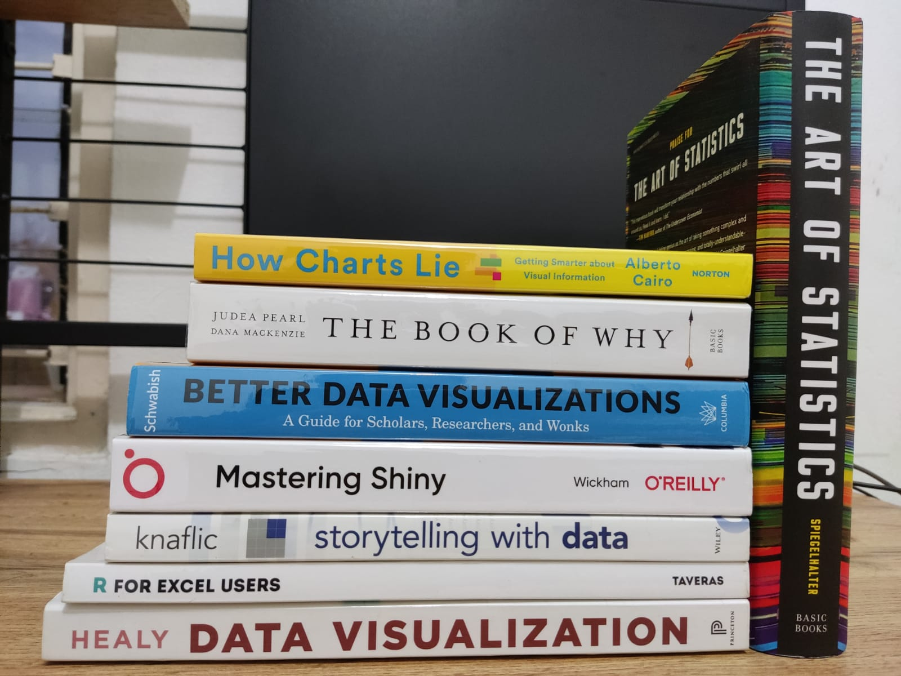

Buku yang bagus adalah buku yang dibaca sampai selesai.
<!--more-->

Tahun 2021 adalah tahun dimana saya mengalokasikan uang makan saya untuk membeli buku-buku di *amazon.com* dan *bookdepository.com*.

Bermula pada awal April 2021, atas dasar ketertarikan dengan visualisasi data, saya khilaf membeli 2 buku sekaligus. **Better Data Visualisation**-nya Jonathan Schwabish di *amazon.com* dan **Storytelling with Data**-nya Cole Nussbaumer Knaflic di *bookdepository.com*.

Kenapa membeli di 2 platform belanja online berbeda? Bukankah lebih boros ongkos kirimnya? Ada 2 alasan mengapa saat itu saya membeli buku di 2 platform belanja online berbeda. Pertama, saya tidak tahu mana yang lebih *recommended*. Kedua, khilaf.

Hasilnya? Pesanan buku dari amazon membutuhkan waktu seminggu pengiriman dari gudang amazon di US ke Indonesia. Dengan catatan, item yang akan kita beli *ships from and sold by Amazon.com* (bukan dari seller lain) dan menggunakan jenis pengiriman *AmazonGlobal Priority Shipping*. Dengan menggunakan jenis pengiriman *AmazonGlobal Priority Shipping*, kita dapat melakukan *live tracking* pesanan kita. Konsekuensinya, biaya akhir lebih mahal.

Bagaimana dengan pembelian di book depository? Pesanan buku dari book depository sampai setelah penantian panjang selama 5 minggu. Jauh lebih murah dibandingkan dengan pembelian di amazon, namun harus sabar menunggu. Selain itu, kita juga harus mengurus sendiri bea masuknya, tak seperti pembelian melalui amazon yang ongkos kirimnya sudah include pembayaran dan pengurusan bea masuk.

Kedua platform belanja diatas punya plus minusnya, *and the choice is yours!*

Bulan Mei 2021 (baru juga sebulan berlalu), saya khilaf lagi dengan membeli 3 buku sekaligus (agar lebih hemat ongkos kirim) melalui amazon. **Data Visualization**-nya Kieran Healy, **R for Excel Users**-nya John L. Taveras, **The Art of Statistics**-nya David Spiegelhalter mendarat tepat waktu.

Setelah beberapa bulan kembali ke jalan yang benar, bulan Oktober 2021 lagi-lagi khilaf. Kali ini **The Book of Why**-nya Judea Pearl, **How Charts Lie**-nya Alberto Cairo, dan **Mastering Shiny**-nya Hadley Wickham.

> *Buku yang bagus adalah buku yang dibaca sampai selesai.*

Dari buku-buku di atas, mana yang bagus dan *recommended*? Wah, saya belum punya kapasitas dan kompetensi untuk menilai kualitas suatu buku. Saya cuma bisa memberikan statement seperti kata orang-orang, *buku yang bagus adalah buku yang dibaca sampai selesai.* Apa saja buku yang dibaca, jika dibaca sampai dengan selesai, maka buku itu bagus.

Jika anda ingin belajar visualisasi data, 2 buku pertama yang saya sarankan untuk anda baca adalah **Better Data Visualisation** dan **Storytelling with Data**. Selamat berbelanja!

