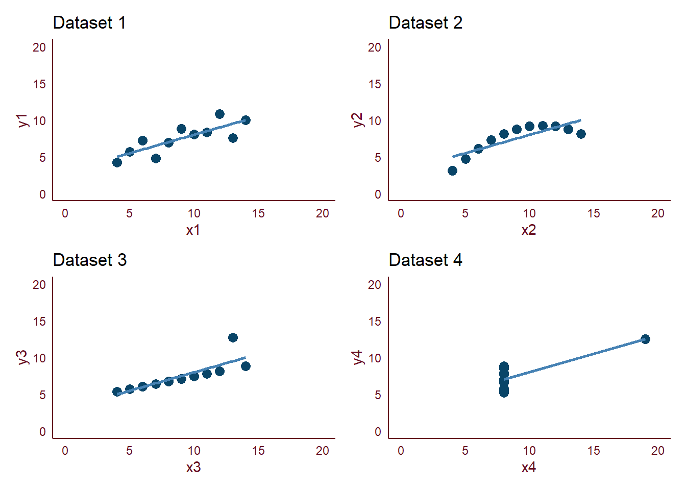

Pentingnya visualisasi data dapat dipahami melalui ilustrasi pada Anscombe's Quartet yang dipublikasikan pada tahun 1973 oleh Francis John Anscombe.
<!--more-->

Pentingnya visualisasi data dapat dipahami melalui ilustrasi pada [Anscombe's Quartet](https://www.tandfonline.com/doi/abs/10.1080/00031305.1973.10478966) yang dipublikasikan pada tahun 1973 oleh Francis John Anscombe.

Anscombe's Quartet menyajikan 4 dataset yang memiliki nilai statistik deskriptif yang hampir sama, namun ternyata ketika divisualisasikan dalam bentuk grafik, memiliki visualisasi yang jauh berbeda.

```{r, include=FALSE, message=FALSE}
library(tidyverse)
library(gt)
library(gtExtras)
```

```{r, include=FALSE}
anscombe_dataset <- anscombe

anscombe_table <- anscombe_dataset %>%
  select(x1,y1,x2,y2,x3,y3,x4,y4) %>%
  gt() %>%
  gt_theme_538() %>% 
  tab_header(title = "Anscombe's Quartet") %>%
  tab_spanner(
    label = "Dataset 1", columns = c(x1,y1)
  ) %>%
  tab_spanner(
    label = "Dataset 2", columns = c(x2,y2)
  ) %>%
  tab_spanner(
    label = "Dataset 3", columns = c(x3,y3)
  ) %>%
  tab_spanner(
    label = "Dataset 4", columns = c(x4,y4)
  ) %>%
  summary_rows(
    fns = list(
      SUM = ~sum(.),
      AVG = ~mean(.),
      SD = ~sd(.)),
    formatter = fmt_number,
    use_seps = FALSE
  ) %>%
  tab_style(
    cell_borders(sides = "right",
                 color = "#000000",
                 style = "solid",
                 weight = px(1)),
    locations = list(
      cells_body(columns = c(y1,y2,y3,y4)),
      cells_column_labels(columns = c(y1,y2,y3,y4))
    )
  ) %>%
  tab_style(
    style = list(
      cell_fill(color = "lightcyan"),
      cell_borders(sides = "right",
                   color = "#000000",
                   style = "solid",
                   weight = px(1))
    ),
    locations = cells_column_spanners()
  ) %>%
  tab_style(
    style = list(
      cell_fill(color = "lightcyan"),
      cell_borders(sides = "right",
                   color = "#000000",
                   style = "solid",
                   weight = px(1))
    ),
    locations = list(
      cells_grand_summary(columns = c(y1,y2,y3,y4), rows = 1),
      cells_grand_summary(columns = c(y1,y2,y3,y4), rows = 2),
      cells_grand_summary(columns = c(y1,y2,y3,y4), rows = 3)
    )
  ) %>%
  tab_style(
    style = list(
      cell_fill(color = "lightcyan"),
      cell_borders(sides = "right",
                   color = "lightcyan",
                   style = "solid",
                   weight = px(1))
    ),
    locations = list(
      cells_grand_summary(columns = c(x1,x2,x3,x4), rows = 1),
      cells_grand_summary(columns = c(x1,x2,x3,x4), rows = 2),
      cells_grand_summary(columns = c(x1,x2,x3,x4), rows = 3)
    )
  ) %>%
  tab_source_note("Tabel dibuat dengan menggunakan gt dan gtExtras package")
```

```{r, echo=FALSE}
anscombe_table
```
<br>
Tanpa melihat visualisasi datanya, keempat dataset di atas sekilas terlihat memiliki nilai statistik deskriptif yang hampir sama, bahkan ketika dihitung persamaan regresi linearnya, keempatnya memiliki persamaan regresi linear yang hampir sama pula.

```{r, include=FALSE}
model_1 <- lm(y1 ~ x1, data = anscombe_dataset)
model_2 <- lm(y2 ~ x2, data = anscombe_dataset)
model_3 <- lm(y3 ~ x3, data = anscombe_dataset)
model_4 <- lm(y4 ~ x4, data = anscombe_dataset)

persamaan <- c(
  paste0("Y1", " = ", round(model_1$coefficients[1],0), " + ", round(model_1$coefficients[2],3), "*X1"),
  paste0("Y2", " = ", round(model_2$coefficients[1],0), " + ", round(model_2$coefficients[2],3), "*X2"),
  paste0("Y3", " = ", round(model_3$coefficients[1],0), " + ", round(model_3$coefficients[2],3), "*X3"),
  paste0("Y4", " = ", round(model_4$coefficients[1],0), " + ", round(model_4$coefficients[2],3), "*X4")
)
```

```{r, echo=FALSE}
persamaan[1]
persamaan[2]
persamaan[3]
persamaan[4]
```
<br>
Namun ternyata keempat dataset di atas sangatlah berbeda ketika divisualisasikan.
```{r anscombe visual, include=FALSE, message=FALSE}
p1 <- anscombe_dataset %>%
  ggplot(aes(x = x1,
             y = y1)) +
  geom_point(size = 3,
             color = '#094568') +
  geom_smooth(method = 'lm',
              se = FALSE,
              color = '#4682B4') +
  scale_x_continuous(limit = c(0,20),
                     breaks = seq(0, 20, by = 5)) +
  scale_y_continuous(limit = c(0,20),
                     breaks = seq(0, 20, by = 5)) +
  theme_minimal() +
  theme(
    axis.title = element_text(color = '#660d20'),
    axis.text = element_text(color = '#660d20'),
    axis.line = element_line(color = '#660d20'),
    panel.grid.major = element_blank(),
    panel.grid.minor = element_blank(),
    strip.text = element_blank(),
    panel.background = element_rect(fill = '#FFFFFF',
                                    color = NA),
    plot.background = element_rect(fill = '#FFFFFF',
                                   color = '#FFFFFF')
  ) +
  labs(title = 'Dataset 1')

p2 <- anscombe_dataset %>%
  ggplot(aes(x = x2,
             y = y2)) +
  geom_point(size = 3,
             color = '#094568') +
  geom_smooth(method = 'lm',
              se = FALSE,
              color = '#4682B4') +
  scale_x_continuous(limit = c(0,20),
                     breaks = seq(0, 20, by = 5)) +
  scale_y_continuous(limit = c(0,20),
                     breaks = seq(0, 20, by = 5)) +
  theme_minimal() +
  theme(
    axis.title = element_text(color = '#660d20'),
    axis.text = element_text(color = '#660d20'),
    axis.line = element_line(color = '#660d20'),
    panel.grid.major = element_blank(),
    panel.grid.minor = element_blank(),
    strip.text = element_blank(),
    panel.background = element_rect(fill = '#FFFFFF',
                                    color = NA),
    plot.background = element_rect(fill = '#FFFFFF',
                                   color = '#FFFFFF')
  ) +
  labs(title = 'Dataset 2')

p3 <- anscombe_dataset %>%
  ggplot(aes(x = x3,
             y = y3)) +
  geom_point(size = 3,
             color = '#094568') +
  geom_smooth(method = 'lm',
              se = FALSE,
              color = '#4682B4') +
  scale_x_continuous(limit = c(0,20),
                     breaks = seq(0, 20, by = 5)) +
  scale_y_continuous(limit = c(0,20),
                     breaks = seq(0, 20, by = 5)) +
  theme_minimal() +
  theme(
    axis.title = element_text(color = '#660d20'),
    axis.text = element_text(color = '#660d20'),
    axis.line = element_line(color = '#660d20'),
    panel.grid.major = element_blank(),
    panel.grid.minor = element_blank(),
    strip.text = element_blank(),
    panel.background = element_rect(fill = '#FFFFFF',
                                    color = NA),
    plot.background = element_rect(fill = '#FFFFFF',
                                   color = '#FFFFFF')
  ) +
  labs(title = 'Dataset 3')

p4 <- anscombe_dataset %>%
  ggplot(aes(x = x4,
             y = y4)) +
  geom_point(size = 3,
             color = '#094568') +
  geom_smooth(method = 'lm',
              se = FALSE,
              color = '#4682B4') +
  scale_x_continuous(limit = c(0,20),
                     breaks = seq(0, 20, by = 5)) +
  scale_y_continuous(limit = c(0,20),
                     breaks = seq(0, 20, by = 5)) +
  theme_minimal() +
  theme(
    axis.title = element_text(color = '#660d20'),
    axis.text = element_text(color = '#660d20'),
    axis.line = element_line(color = '#660d20'),
    panel.grid.major = element_blank(),
    panel.grid.minor = element_blank(),
    strip.text = element_blank(),
    panel.background = element_rect(fill = '#FFFFFF',
                                    color = NA),
    plot.background = element_rect(fill = '#FFFFFF',
                                   color = '#FFFFFF')
  ) +
  labs(title = 'Dataset 4')

library(patchwork)

anscombe <- (p1|p2)/(p3|p4)
anscombe
```



<br>
Dari visualisasi di atas, dapat dipahami bahwa:

* pada dataset 1 terlihat bahwa variabel x dan y memiliki hubungan yang linear. <br>
* pada dataset 2 terlihat bahwa variabel x dan y memiliki hubungan non-linear. <br>
* pada dataset 3 terlihat bahwa variabel x dan y memiliki hubungan yang linear dan terdapat 1 outlier. <br>
* pada dataset 4 terlihat bahwa 1 outlier ekstrim mampu mempengaruhi persamaan linear dari keseluruhan data pada dataset 4. <br>

<br>

###### Kesimpulan
Dari ilustrasi pada Anscombe's Dataset diatas dapat disimpulkan bahwa visualisasi data adalah hal yang penting untuk dilakukan sebelum menganalisis hubungan antar variabel dalam suatu dataset karena perhitungan statistik deskriptif saja tidaklah cukup untuk menggambarkan keadaan dataset sesungguhnya.