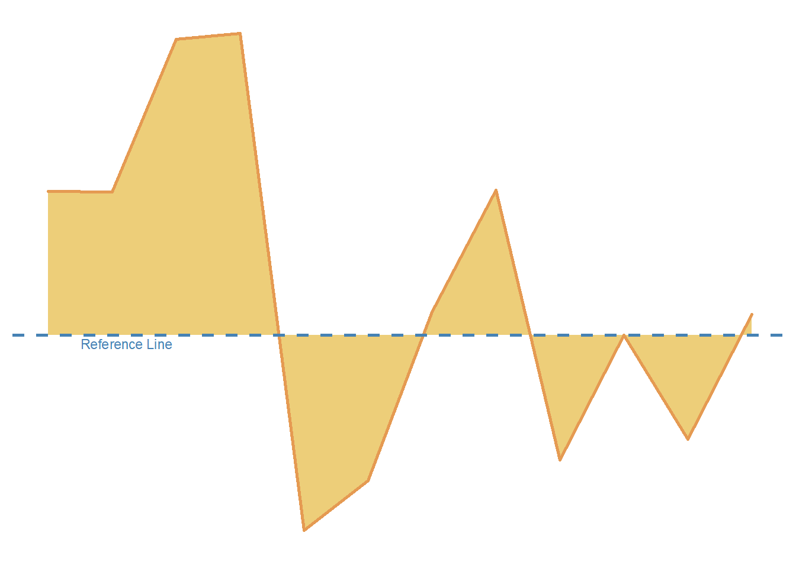

<!--more-->

```{r, message=FALSE}
library(tidyverse)    # untuk manupulasi, merapikan, & visualisasi data
library(gapminder)    # untuk mengakses gapminder dataset
library(geomtextpath) # untuk membuat Line Text
```

```{r}
s_d_filled_line_df <- gapminder %>%
  filter(continent == 'Asia') %>%
  group_by(year) %>%
  mutate(median_gdp = median(gdpPercap),
         gdp_gap = gdpPercap - median_gdp) %>%
  filter(country == 'Jordan')
```

```{r}
s_d_filled_line <- s_d_filled_line_df %>%
  ggplot(aes(x = year,
             y = gdp_gap)) +
  geom_area(color ='#e59a52',
            size = 1,
            fill = '#edce79') +
  geom_texthline(yintercept = 0,
                 label = 'Reference Line',
                 size = 3,
                 vjust = 1.2,
                 hjust = .1,
                 linewidth = 1,
                 linecolor = '#4682B4',
                 linetype = 2, 
                 color = '#4682B4') +
  scale_x_continuous(limits = c(1952, 2007),
                     breaks = seq(1952, 2007, by = 5)) +
  theme_minimal() +
  theme(
    axis.title = element_blank(),
    axis.text = element_blank(),
    axis.line = element_blank(),
    panel.grid.major = element_blank(),
    panel.grid.minor = element_blank(),
    panel.background = element_rect(fill = '#FFFFFF',
                                    color = NA),
    plot.background = element_rect(fill = '#FFFFFF',
                                   color = '#FFFFFF')
  )
```

```{r s_d_filled_line, include=FALSE}
s_d_filled_line
```

