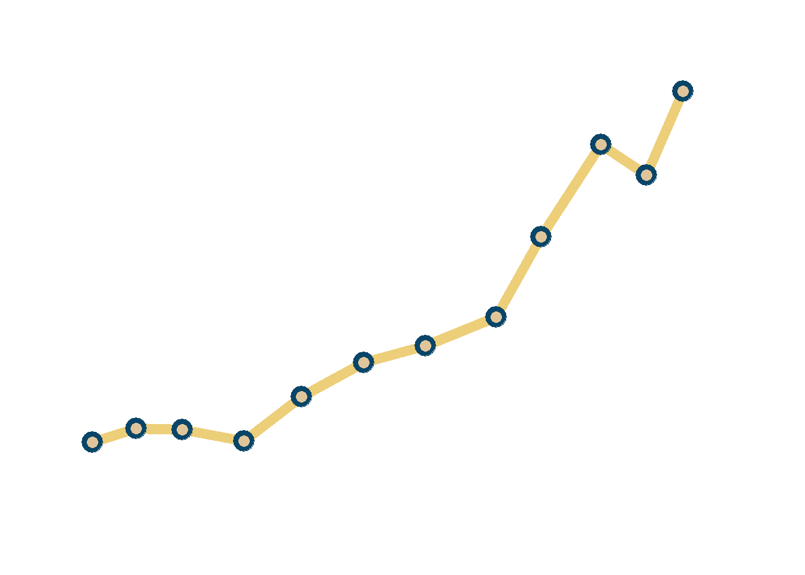

<!--more-->

```{r, message=FALSE}
library(tidyverse)    # untuk manupulasi, merapikan, & visualisasi data
library(gapminder)    # untuk mengakses gapminder dataset
```

```{r}
con_scatter_plot_df <- gapminder %>%
  filter(country == 'Indonesia')
```

```{r}
con_scatter_plot <- con_scatter_plot_df %>%
  ggplot(aes(x = lifeExp,
             y = gdpPercap)) +
  geom_path(size = 3,
            color = '#edce79') +
  geom_point(size = 6,
             color = '#094568') +
  geom_point(size = 3,
             color = '#e1c59a') +
  scale_x_continuous(limits = c(35, 75),
                     breaks = seq(35, 75, by = 5)) +
  scale_y_continuous(limits = c(0, 4000),
                     breaks = seq(0, 4000, by = 1000)) +
  theme_minimal() +
  theme(
    axis.title = element_blank(),
    axis.text = element_blank(),
    axis.line = element_blank(),
    panel.grid.major = element_blank(),
    panel.grid.minor = element_blank(),
    strip.text = element_blank(),
    panel.background = element_rect(fill = '#FFFFFF',
                                    color = NA),
    plot.background = element_rect(fill = '#FFFFFF',
                                   color = '#FFFFFF')
  )
```

```{r connected scatter plot, include=FALSE}
con_scatter_plot
```

