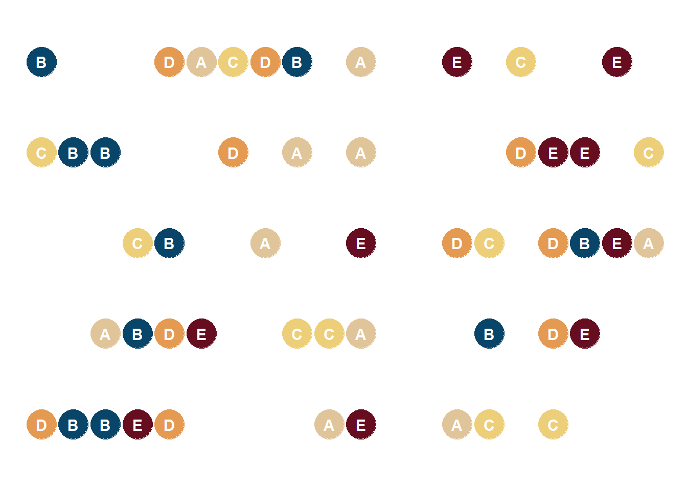

<!--more-->

```{r, message=FALSE}
library(tidyverse)    # untuk manupulasi, merapikan, & visualisasi data
```

```{r}
our_palette <-c('#e1c59a',
                '#094568',
                '#edce79',
                '#e59a52',
                '#660d20')
```

```{r}
set.seed(2000)
df1 = tibble(var1 = 'One',
             var2 = c('A','B','C','D','E','A','B','C','D','E'),
             val = sample(1:20, 10))
df2 = tibble(var1 = 'Two',
             var2 = c('A','B','C','D','E','A','B','C','D','E'),
             val = sample(1:20, 10))
df3 = tibble(var1 = 'Three',
             var2 = c('A','B','C','D','E','A','B','C','D','E'),
             val = sample(1:20, 10))
df4 = tibble(var1 = 'Four',
             var2 = c('A','B','C','D','E','A','B','C','D','E'),
             val = sample(1:20, 10))
df5 = tibble(var1 = 'Five',
             var2 = c('A','B','C','D','E','A','B','C','D','E'),
             val = sample(1:20, 10))

dot_strip_plot_df <- rbind(df1, df2, df3, df4, df5)
```

```{r}
dot_strip_plot_rank <- dot_strip_plot_df %>%
  ggplot(aes(x = val,
             y = var1,
             color = var2,
             fill = var2)) +
  geom_point(size = 10) +
  geom_text(aes(label = var2),
            size = 4,
            fontface = 'bold',
            color = 'white') +
  scale_color_manual(values = our_palette,
                     guide = 'none') +
  scale_fill_manual(values = our_palette,
                    guide = 'none') +
  theme_minimal() +
  theme(
    axis.title = element_blank(),
    axis.text = element_blank(),
    axis.line = element_blank(),
    panel.grid.major = element_blank(),
    panel.grid.minor = element_blank(),
    panel.background = element_rect(fill = '#FFFFFF',
                                    color = NA),
    plot.background = element_rect(fill = '#FFFFFF',
                                   color = '#FFFFFF')
  )
```

```{r dot strip plot ranking, include=FALSE}
dot_strip_plot_rank
```

