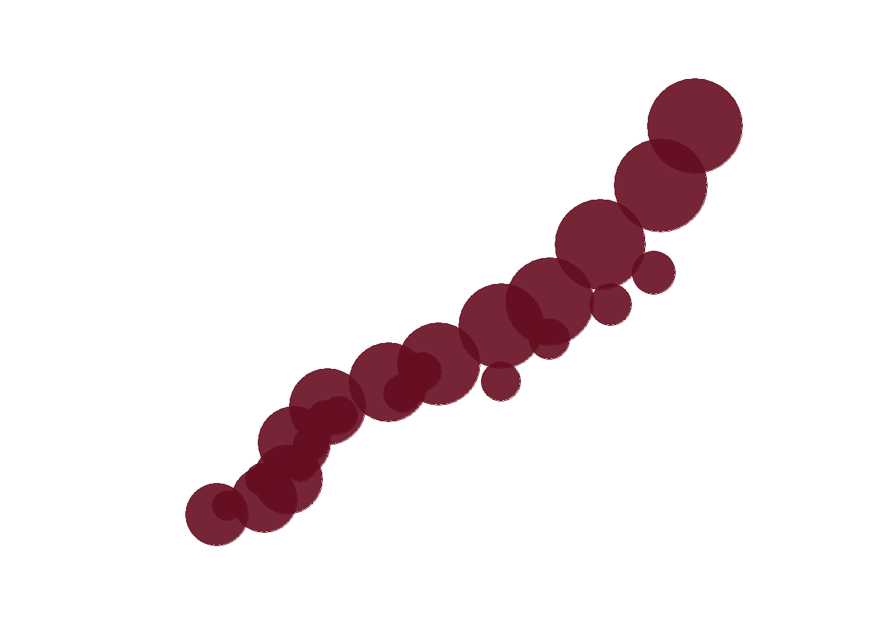

<!--more-->

```{r, message=FALSE}
library(tidyverse)    # untuk manupulasi, merapikan, & visualisasi data
library(gapminder)    # untuk mengakses gapminder dataset
```

```{r}
bubble_df <- gapminder %>%
  filter(continent == 'Oceania')
```

```{r}
bubble <- bubble_df %>%
  ggplot(aes(x = lifeExp,
             y = gdpPercap,
             color = country,
             size = pop)) +
  geom_point(alpha = 0.9,
             color = '#660d20') +
  scale_size_area(max_size = 25,
                  guide = 'none') +
  scale_x_continuous(limits = c(65, 85),
                     breaks = seq(65, 85, by = 5)) +
  scale_y_continuous(limits = c(5000, 40000),
                     breaks = seq(10000, 40000, by = 10000)) +
  theme_minimal() +
  theme(
    axis.title = element_blank(),
    axis.text = element_blank(),
    axis.line = element_blank(),
    panel.grid.major = element_blank(),
    panel.grid.minor = element_blank(),
    strip.text = element_blank(),
    panel.background = element_rect(fill = '#FFFFFF',
                                    color = NA),
    plot.background = element_rect(fill = '#FFFFFF',
                                   color = '#FFFFFF')
  )
```

```{r bubble, include=FALSE}
bubble
```

