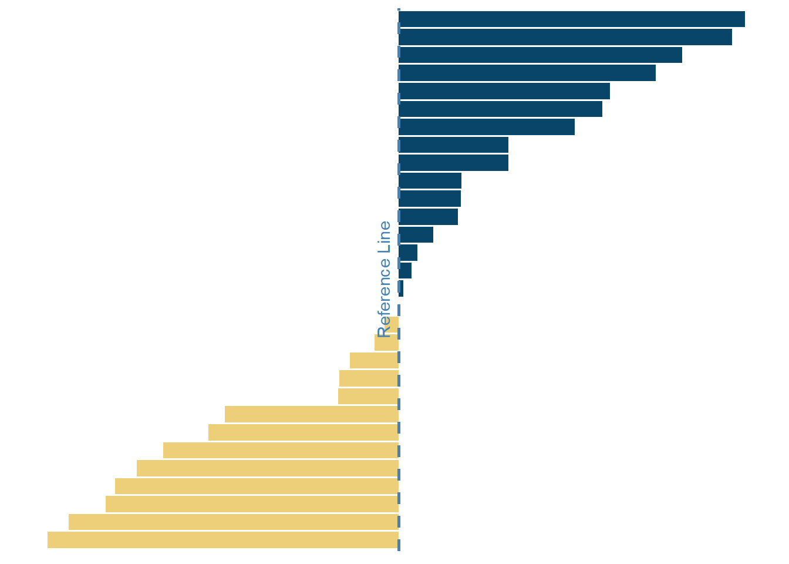

<!--more-->

```{r, message=FALSE}
library(tidyverse)    # untuk manupulasi, merapikan, & visualisasi data
library(gapminder)    # untuk mengakses gapminder dataset
library(geomtextpath) # untuk membuat Line Text
```

```{r}
diverging_bar_df <- gapminder %>%
  filter(continent == 'Asia',
         year == 2007) %>%
  mutate(median_lifeExp = median(lifeExp),
         lifeExp_gap = lifeExp - median_lifeExp) %>%
  filter(between(lifeExp_gap, -12, 12))
```

```{r}
diverging_bar <- diverging_bar_df %>%
  ggplot(aes(x = lifeExp_gap,
             y = reorder(country, lifeExp_gap),
             fill = lifeExp_gap)) +
  geom_col(fill = if_else(diverging_bar_df$lifeExp_gap > 0,
                          '#094568',
                          '#edce79')) +
  geom_textvline(xintercept = 0,
                 label = 'Reference Line',
                 vjust = -0.5,
                 hjust = .5,
                 linewidth = 1,
                 linecolor = '#4682B4',
                 linetype = 2, 
                 color = '#4682B4') +
  theme_minimal() +
  theme(
    axis.title = element_blank(),
    axis.text = element_blank(),
    axis.line = element_blank(),
    panel.grid.major = element_blank(),
    panel.grid.minor = element_blank(),
    panel.background = element_rect(fill = '#FFFFFF',
                                    color = NA),
    plot.background = element_rect(fill = '#FFFFFF',
                                   color = '#FFFFFF')
  )
```

```{r diverging bar, include=FALSE}
diverging_bar
```

