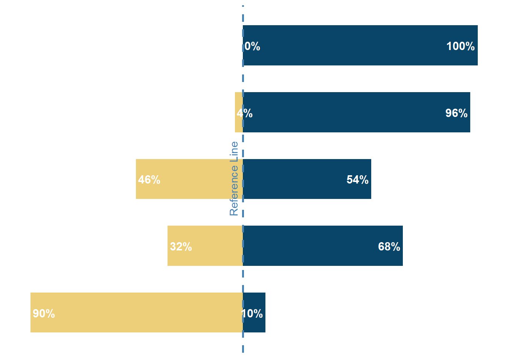

<!--more-->

```{r, message=FALSE}
library(tidyverse)    # untuk manupulasi, merapikan, & visualisasi data
library(gapminder)    # untuk mengakses gapminder dataset
library(geomtextpath) # untuk membuat Line Text
```

```{r}
diverging_stacked_bar_df <- gapminder %>%
  filter(year == 2007) %>%
  mutate(median_lifeExp = median(lifeExp)) %>%
  group_by(continent) %>%
  summarize(below_med = sum(lifeExp < median_lifeExp)/n(),
            beyond_med = sum(lifeExp >= median_lifeExp)/n()) %>%
  pivot_longer(!continent,
               names_to = 'cluster',
               values_to = 'percent_country') %>%
  mutate(percent_country = if_else(cluster == 'below_med',
                                   -percent_country,
                                   percent_country))
```

```{r}
diverging_stacked_bar <- diverging_stacked_bar_df %>%
  ggplot(aes(x = percent_country,
             y = continent,
             fill = cluster)) + 
  geom_col(width = .6,
           fill = if_else(diverging_stacked_bar_df$percent_country > 0,
                          '#094568',
                          '#edce79')) +
  geom_textvline(xintercept = 0,
                 label = 'Reference Line',
                 vjust = -0.5,
                 hjust = .5,
                 linewidth = 1,
                 linecolor = '#4682B4',
                 linetype = 2, 
                 color = '#4682B4') +
  geom_text(aes(label = scales::percent(abs(percent_country), 2),
                hjust = ifelse(percent_country > 0, 1.1, -.1)),
            size = 4,
            fontface = 'bold',
            color = 'white') +
  theme_minimal() +
  theme(
    axis.title = element_blank(),
    axis.text = element_blank(),
    axis.line = element_blank(),
    panel.grid.major = element_blank(),
    panel.grid.minor = element_blank(),
    panel.background = element_rect(fill = '#FFFFFF',
                                    color = NA),
    plot.background = element_rect(fill = '#FFFFFF',
                                   color = '#FFFFFF')
  )
```

```{r diverging stacked bar, include=FALSE}
diverging_stacked_bar
```

