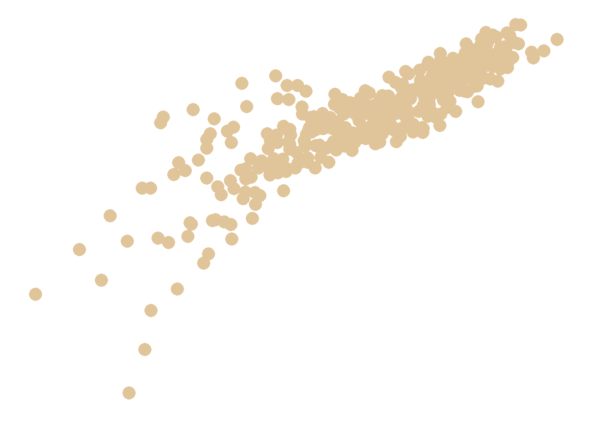

<!--more-->

```{r, message=FALSE}
library(tidyverse)    # untuk manupulasi, merapikan, & visualisasi data
library(gapminder)    # untuk mengakses gapminder dataset
```

```{r}
scatter_plot_df <- gapminder %>%
  filter(continent == 'Europe')
```

```{r}
scatter_plot <- scatter_plot_df %>%
  ggplot(aes(x = log(gdpPercap),
             y = lifeExp)) +
  geom_point(size = 5,
             color = '#e1c59a') +
  theme_minimal() +
  theme(
    axis.title = element_blank(),
    axis.text = element_blank(),
    axis.line = element_blank(),
    panel.grid.major = element_blank(),
    panel.grid.minor = element_blank(),
    strip.text = element_blank(),
    panel.background = element_rect(fill = '#FFFFFF',
                                    color = NA),
    plot.background = element_rect(fill = '#FFFFFF',
                                   color = '#FFFFFF')
  )
```

```{r scatter_plot, include=FALSE}
scatter_plot
```

