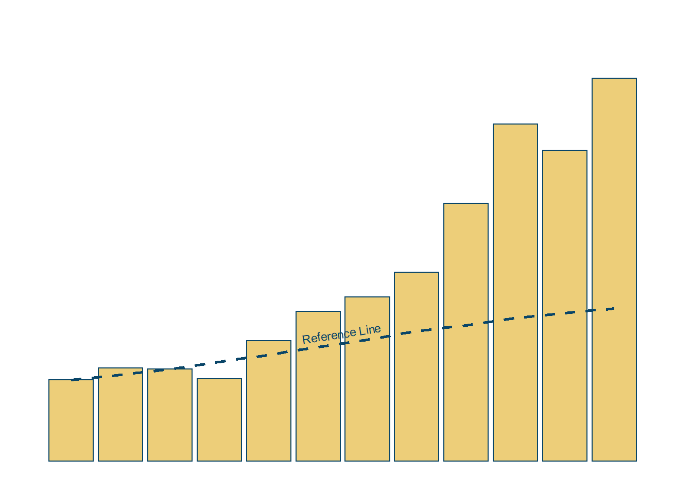

<!--more-->

```{r, message=FALSE}
library(tidyverse)    # untuk manupulasi, merapikan, & visualisasi data
library(gapminder)    # untuk mengakses gapminder dataset
library(geomtextpath) # untuk membuat Line Text
```

```{r}
col_line_tl_df <- gapminder %>%
  filter(country == 'Indonesia')
```

```{r}
col_line_tl <- col_line_tl_df %>%
  ggplot(aes(x = year,
             y = gdpPercap)) +
  geom_col(color = '#094568',
           fill = '#edce79') +
  geom_textline(aes(x = year,
                    y = lifeExp*20),
                label = 'Reference Line',
                size = 3,
                vjust = -0.5,
                linewidth = 1,
                linecolor = '#094568',
                linetype = 2, 
                color = '#094568') +
  scale_x_continuous(limits = c(1949, 2011),
                     breaks = seq(1952, 2007, by = 5)) +
  scale_y_continuous(limits = c(0, 4000),
                     breaks = seq(0, 4000, by = 1000)) +
  theme_minimal() +
  theme(
    axis.title = element_blank(),
    axis.text = element_blank(),
    axis.line = element_blank(),
    panel.grid.major = element_blank(),
    panel.grid.minor = element_blank(),
    strip.text = element_blank(),
    panel.background = element_rect(fill = '#FFFFFF',
                                    color = NA),
    plot.background = element_rect(fill = '#FFFFFF',
                                   color = '#FFFFFF')
  )
```

```{r column line timeline, include=FALSE}
col_line_tl
```

