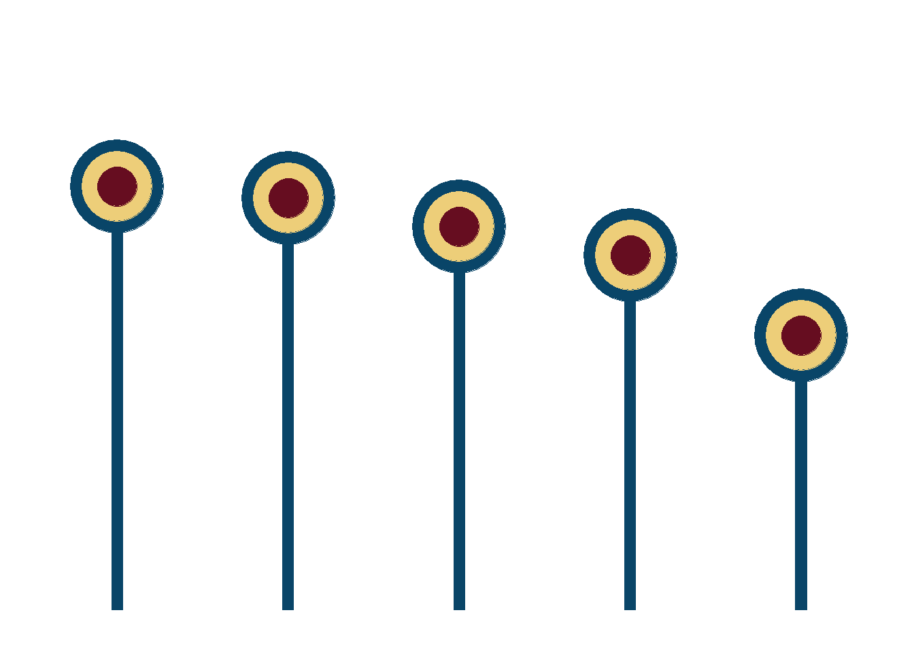

<!--more-->

```{r, message=FALSE}
library(tidyverse)    # untuk manupulasi, merapikan, & visualisasi data
library(gapminder)    # untuk mengakses gapminder dataset
```

```{r}
lollipop_df <- gapminder %>%
  group_by(continent) %>%
  summarize(medianlifeExp = round(median(lifeExp),0))
```

```{r}
lollipop <-lollipop_df %>%
  ggplot(aes(x = reorder(continent, -medianlifeExp),
             y = medianlifeExp)) +
  geom_col(alpha = 1,
           width = .06,
           color = '#094568',
           fill = '#094568',
           show.legend = FALSE) +
  geom_point(alpha = 1,
             size = 24,
             color = '#094568',
             show.legend = FALSE) +
  geom_point(alpha = 1,
             size = 18,
             color = '#edce79',
             show.legend = FALSE) +
  geom_point(alpha = 1,
             size = 10,
             color = '#660d20',
             show.legend = FALSE) +
  scale_y_continuous(limits = c(0, 100)) +
  theme_minimal() +
  theme(
    axis.title = element_blank(),
    axis.text = element_blank(),
    axis.line = element_blank(),
    panel.grid.major = element_blank(),
    panel.grid.minor = element_blank(),
    panel.background = element_rect(fill = '#FFFFFF',
                                    color = NA),
    plot.background = element_rect(fill = '#FFFFFF',
                                   color = '#FFFFFF')
  )
```

```{r lollipop, include=FALSE}
lollipop
```

