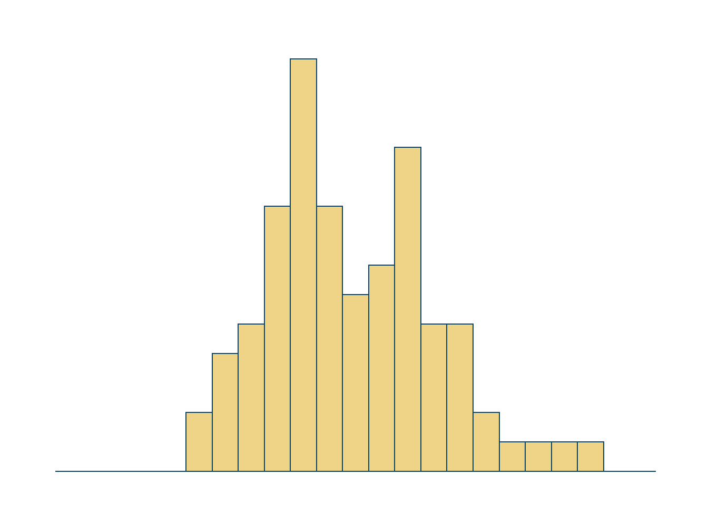

<!--more-->

```{r, message=FALSE}
library(tidyverse)    # untuk manupulasi, merapikan, & visualisasi data
```

```{r}
set.seed(2000)
df1 = tibble(var = 'A', val = rnorm(n = 25, mean = 5.5, sd = 1.5))
df2 = tibble(var = 'B', val = rnorm(n = 15, mean = 4.5, sd = 1.0))
df3 = tibble(var = 'C', val = rnorm(n = 20, mean = 5.0, sd = 1.0))
df4 = tibble(var = 'D', val = rnorm(n = 10, mean = 4.0, sd = 0.5))
df5 = tibble(var = 'E', val = rnorm(n = 13, mean = 5.0, sd = 1.5))

df <- rbind(df1, df2, df3, df4, df5) %>%
  mutate(Variable = as_factor(var),
         value = round(val, 2)) %>%
  select(Variable, value)
```

```{r}
histogram <- df %>%
  ggplot(aes(x = value)) +
  geom_histogram(bins = 25,
                 alpha = .9,
                 color = '#094568',
                 fill = '#edce79') +
  scale_x_continuous(limits = c(0,10)) +
  scale_y_continuous(limits = c(0, 15)) +
  theme_minimal() +
  theme(
    axis.title = element_blank(),
    axis.text = element_blank(),
    axis.line = element_blank(),
    panel.grid.major = element_blank(),
    panel.grid.minor = element_blank(),
    panel.background = element_rect(fill = '#FFFFFF',
                                    color = NA),
    plot.background = element_rect(fill = '#FFFFFF',
                                   color = '#FFFFFF')
  )
```

```{r histogram, include=FALSE}
histogram
```

