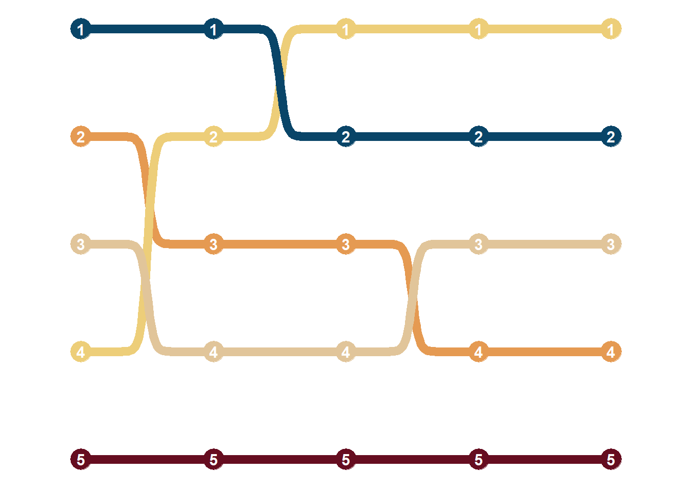

<!--more-->

```{r, message=FALSE}
library(tidyverse)    # untuk manupulasi, merapikan, & visualisasi data
library(gapminder)    # untuk mengakses gapminder dataset
```

```{r}
our_palette <-c('#660d20',
                '#e59a52',
                '#edce79',
                '#094568',
                '#e1c59a')
```

```{r}
bump_df <- gapminder %>%
  filter(year %in% c(1967,1977,1987,1997,2007)) %>%
  group_by(continent, year) %>%
  summarize(maxlifeExp = max(lifeExp)) %>%
  group_by(year) %>%
  mutate(ranking = dense_rank(desc(maxlifeExp)))
```

```{r, message=FALSE}
bump <- bump_df %>%
  ggplot(aes(x = year,
             y = ranking,
             color = continent)) +
  ggbump::geom_bump(size = 3,
                    smooth = 20,
                    show.legend = FALSE) +
  geom_point(size = 7) +
  geom_text(aes(label = ranking),
            size = 4,
            fontface = 'bold',
            color = 'white') +
  scale_color_manual(values = our_palette,
                     guide = 'none') +
  scale_y_reverse() +
  scale_x_continuous(limits = c(1964,2010),
                     breaks = c(1967,1977,1987,1997,2007)) +
  theme_minimal() +
  theme(
    axis.title = element_blank(),
    axis.text = element_blank(),
    axis.line = element_blank(),
    panel.grid.major = element_blank(),
    panel.grid.minor = element_blank(),
    panel.background = element_rect(fill = '#FFFFFF',
                                    color = NA),
    plot.background = element_rect(fill = '#FFFFFF',
                                   color = '#FFFFFF')
  )
```

```{r bump chart, include=FALSE}
bump
```

