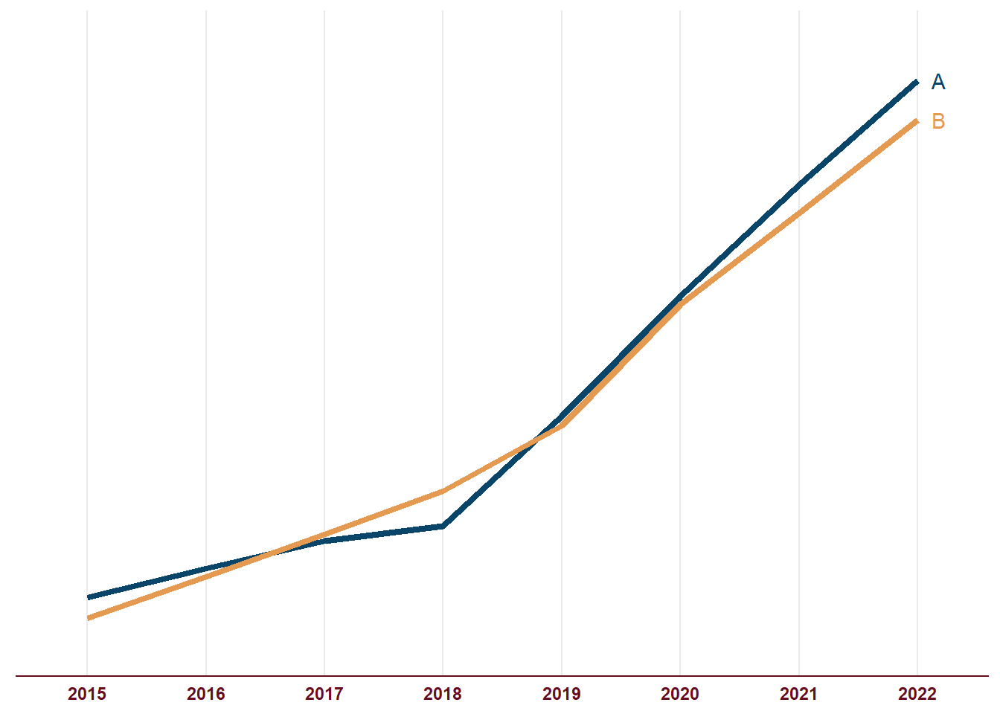

<!--more-->

```{r, message=FALSE}
library(tidyverse)    # untuk manupulasi, merapikan, & visualisasi data
```

```{r}
set.seed(123)
df_for_cum_curve = tibble(
  var = c('A', 'A', 'A', 'A', 'A', 'A', 'A', 'A',
          'B', 'B', 'B', 'B', 'B', 'B', 'B', 'B'),
  year = c('2015', '2016', '2017', '2018',
           '2019', '2020', '2021', '2022',
           '2015', '2016', '2017', '2018',
           '2019', '2020', '2021', '2022'),
  val = c(sample(10:50, size = 4, replace = TRUE),
          sample(50:100, size = 4, replace = TRUE),
          sample(10:50, size = 4, replace = TRUE),
          sample(50:100, size = 4, replace = TRUE)))

df_for_cum_curve <- df_for_cum_curve %>%
  group_by(var) %>%
  mutate(cumulative_val = cumsum(val))
```

```{r}
cumulative_curve <- df_for_cum_curve %>%
  ggplot(aes(x = year,
             y = cumulative_val,
             group = var,
             color = var)) +
  geom_line(size = 1.5) +
  geom_text(data = subset(df_for_cum_curve,year == '2022'),
            aes(label = var),
            hjust = -1) +
  scale_color_manual(values = c('#094568', '#e59a52'),
                     guide = 'none') +
  scale_y_continuous(limits = c(0, 500)) +
  theme_minimal() +
  theme(
    axis.title = element_blank(),
    axis.text.x = element_text(color = '#660d20',
                               face = 'bold'),
    axis.text.y = element_blank(),
    axis.line.x = element_line(color = '#660d20',
                               size = .5),
    axis.line.y = element_blank(),
    panel.grid.major.y = element_blank(),
    panel.grid.minor = element_blank(),
    panel.background = element_rect(fill = '#FFFFFF',
                                    color = NA),
    plot.background = element_rect(fill = '#FFFFFF',
                                   color = '#FFFFFF')
  )
```

```{r cumulative curve, include=FALSE}
cumulative_curve
```

