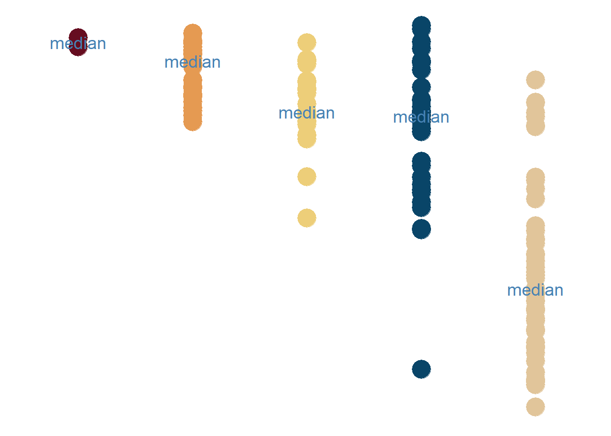

Ordered by Median
<!--more-->

Ordered by Median

```{r, message=FALSE}
library(tidyverse)    # untuk manupulasi, merapikan, & visualisasi data
library(gapminder)    # untuk mengakses gapminder dataset
```

```{r}
our_palette <-c('#660d20',
                '#e59a52',
                '#edce79',
                '#094568',
                '#e1c59a')
```

```{r}
ordered_dot_strip_plot_df <- gapminder %>%
  filter(year == 2007) %>%
  group_by(continent) %>%
  mutate(medianlifeExp = median(lifeExp))
```

```{r}
ordered_dot_strip_plot <- ordered_dot_strip_plot_df  %>%
 ggplot(aes(x = reorder(continent, -medianlifeExp),
            y = lifeExp,
            color = reorder(continent, -medianlifeExp),
            fill = reorder(continent, -medianlifeExp))) +
  geom_point(size = 7) +
  scale_color_manual(values = our_palette,
                     guide = 'none') +
  scale_fill_manual(values = our_palette,
                    guide = 'none') +
  stat_summary(fun = 'median',
               geom = 'text',
               label = 'median',
               size = 5,
               color = '#4682B4') + 
  theme_minimal() +
  theme(
    axis.title = element_blank(),
    axis.text = element_blank(),
    axis.line = element_blank(),
    panel.grid.major = element_blank(),
    panel.grid.minor = element_blank(),
    panel.background = element_rect(fill = '#FFFFFF',
                                    color = NA),
    plot.background = element_rect(fill = '#FFFFFF',
                                   color = '#FFFFFF')
  )
```

```{r ordered dot strip plot, include=FALSE}
ordered_dot_strip_plot
```

