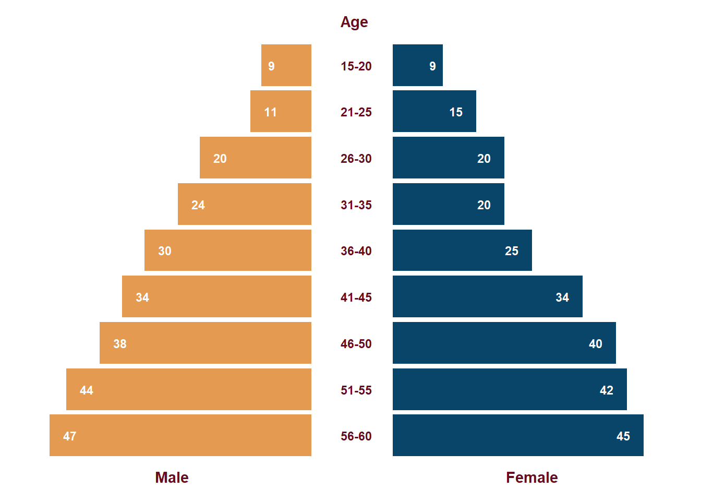

<!--more-->

```{r, message=FALSE}
library(tidyverse)    # untuk manupulasi, merapikan, & visualisasi data
```

```{r}
set.seed(2000)
df1 = tibble(gender = 'Male', age = '15-20',
             value = sample((5:10), size = 1))
df2 = tibble(gender = 'Male', age = '21-25',
             value = sample((10:15), size = 1))
df3 = tibble(gender = 'Male', age = '26-30',
             value = sample((15:20), size = 1))
df4 = tibble(gender = 'Male', age = '31-35',
             value = sample((20:25), size = 1))
df5 = tibble(gender = 'Male', age = '36-40',
             value = sample((25:30), size = 1))
df6 = tibble(gender = 'Male', age = '41-45',
             value = sample((30:35), size = 1))
df7 = tibble(gender = 'Male', age = '46-50',
             value = sample((35:40), size = 1))
df8 = tibble(gender = 'Male', age = '51-55',
             value = sample((40:45), size = 1))
df9 = tibble(gender = 'Male', age = '56-60',
             value = sample((45:50), size = 1))
df10 = tibble(gender = 'Female', age = '15-20',
              value = sample((5:10), size = 1))
df11 = tibble(gender = 'Female', age = '21-25',
              value = sample((10:15), size = 1))
df12 = tibble(gender = 'Female', age = '26-30',
              value = sample((15:20), size = 1))
df13 = tibble(gender = 'Female', age = '31-35',
              value = sample((20:25), size = 1))
df14 = tibble(gender = 'Female', age = '36-40',
              value = sample((25:30), size = 1))
df15 = tibble(gender = 'Female', age = '41-45',
              value = sample((30:35), size = 1))
df16 = tibble(gender = 'Female', age = '46-50',
              value = sample((35:40), size = 1))
df17 = tibble(gender = 'Female', age = '51-55',
              value = sample((40:45), size = 1))
df18 = tibble(gender = 'Female', age = '56-60',
              value = sample((45:50), size = 1))

df_for_pop_pyramid <- rbind(df1, df2, df3, df4, df5, df6,
                            df7, df8, df9, df10, df11, df12,
                            df13, df14, df15, df16, df17, df18) %>%
  mutate(age = as.factor(age))
```

```{r}
female_side <- df_for_pop_pyramid %>%
  filter(gender == 'Female') %>%
  ggplot(aes(x = value,
             y = reorder(age, desc(age)),
             fill = gender)) +
  geom_col(fill =  '#094568') +
  geom_text(aes(label = value),
            hjust = 2,
            size = 3,
            fontface = 'bold',
            color = 'white') +
  scale_x_continuous(limits = c(0, 50)) +
  theme_minimal() +
  theme(
    plot.title.position = 'plot',
    plot.subtitle = element_text(color = '#660d20',
                                 face = 'bold'),
    axis.title.x = element_text(color = '#660d20',
                                face = 'bold'),
    axis.title.y = element_blank(),
    axis.text.x = element_blank(),
    axis.text.y = element_text(color = '#660d20',
                               face = 'bold'),
    panel.grid.major = element_blank(),
    panel.grid.minor = element_blank(),
    panel.background = element_rect(fill = '#ffffff',
                                    color = NA),
    plot.background = element_rect(fill = '#ffffff',
                                   color = '#ffffff')
  ) +
  xlab('Female') +
  labs(subtitle = 'Age')
```

```{r}
male_side <- df_for_pop_pyramid %>%
  filter(gender == 'Male') %>%
  ggplot(aes(x = -value,
             y = reorder(age, desc(age)),
             fill = gender)) +
  geom_col(fill = '#e59a52') +
  geom_text(aes(label = value),
            hjust = -1,
            size = 3,
            fontface = 'bold',
            color = 'white') +
  scale_x_continuous(limits = c(-50, 0)) +
  theme_minimal() +
  theme(
    axis.title.x = element_text(color = '#660d20',
                                face = 'bold'),
    axis.title.y = element_blank(),
    axis.text.x = element_blank(),
    axis.text.y = element_blank(),
    panel.grid.major = element_blank(),
    panel.grid.minor = element_blank(),
    panel.background = element_rect(fill = '#ffffff',
                                    color = NA),
    plot.background = element_rect(fill = '#ffffff',
                                   color = '#ffffff')
  ) +
  xlab('Male')
```

```{r, message=FALSE}
library(patchwork) 
```

```{r}
pop_pyramid <- (male_side|female_side) +
  plot_annotation(
    theme = theme(
      panel.background = element_rect(fill = '#FFFFFF',
                                    color = NA),
      plot.background = element_rect(fill = '#FFFFFF',
                                     color = '#FFFFFF')
    ))
```

```{r pop pyramid, include=FALSE}
pop_pyramid
```

